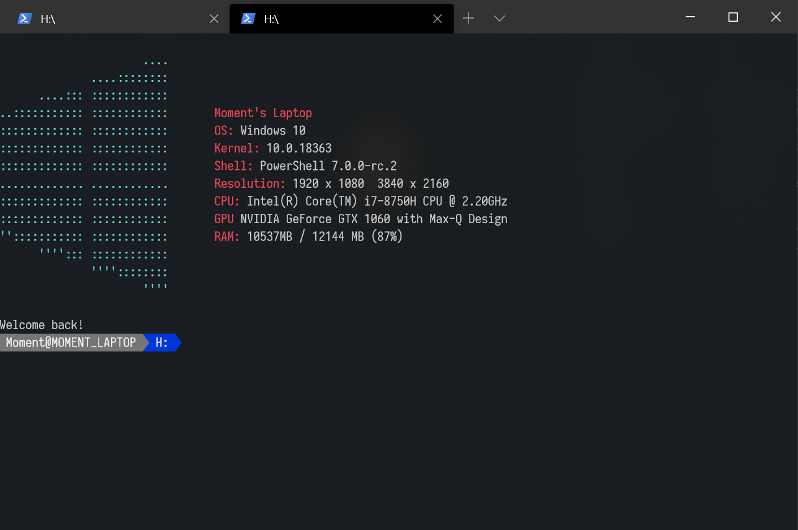

# Windows screenFetch
adapt from https://github.com/JulianChow94/Windows-screenFetch

这是一个在powershell上打印系统信息的一个小模块，我一般用来做powershell的欢迎语，这方面在我的博客中有介绍 https://momincong.xyz/index.php/archives/126/

上面标题下面那个是原作者，他好像是已经弃坑了，但刚好这两三年powershell变化巨大，里面获取wim对象的函数已经被淘汰了，我稍微做了下修改，减少了一些占用时间项目，精简了一下

在此感谢原作者，我只是修改了很小很小的部分

效果如下：

## ScreenFetch

### 使用

直接将文件夹整体放入Module目录下，然后输入`windowsfetch`这个命令就可以看到效果

在后面附上`-distro mac`参数可以看到苹果标的

### 一些注意事项

这个模块在调用的时候会清空屏幕（clear）

如果是在虚拟机等无屏幕的系统上，显示分辨率那栏会出现异常，暂时不打算解决（甚至有点想重写这玩意，但太懒了）